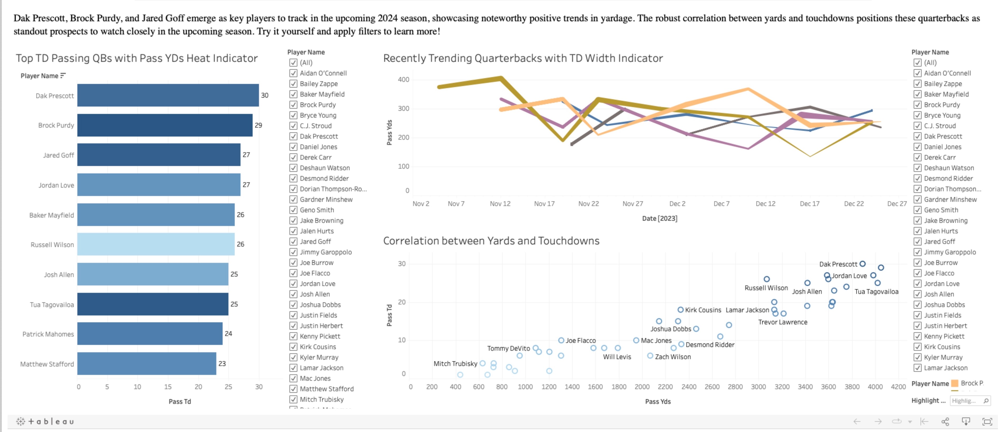

# NFL-Stats
Welcome to the NFL Stas Analysis Data Visualization project! This respository houses a couple Python scripts that retrieves up-to-date NFL statistics for players from ESPN's website. The collected data is then seamlessly integrated into a Tableau dashboard for insightful visualization and analysis.

## Table of Contents
- [Usage](#usage)
- [Contact info](#contact)

## Usage
Visit to interact with updated stats in real-time: https://www.jakelender.com/tech-portfolio/player-analysis

Click on the player filters to choose which players compete for the top spots!

## Contact
For questions or feedback, contact [Github](https://github.com/JacobLender) or [Portfolio](https://www.jakelender.com/aboutme)
