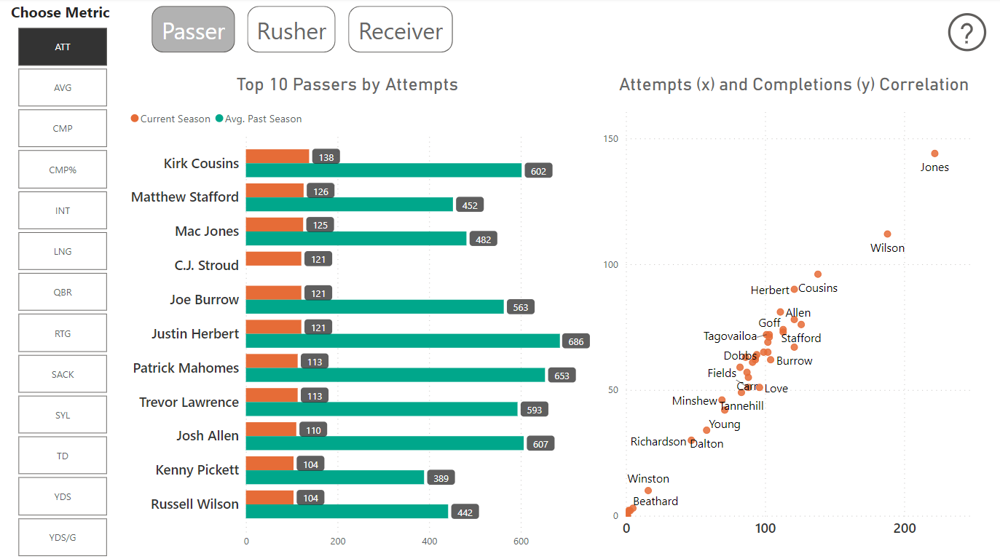

# NFL-Stats
Welcome to the NFL Stats Data Visualization project! This respository houses a Python script that retrieves up-to-date NFL statistics for passing, rushing, and receiving from ESPN. The collected data is then seamlessly integrated into Power BI dashboards for insightful visualization and analysis.

## Table of Contents

- [Installation](#installation)
- [Usage](#usage)
- [Contact info](#contact)

## Installation
Installation Instructions for Power BI Desktop
Step 1: Download Power BI Desktop

Open your web browser and go to the official Power BI Desktop download page: Power BI Desktop Download.
Click on the "Download free" button to start the download. Choose the appropriate version for your operating system (Windows 64-bit or 32-bit).
Step 2: Install Power BI Desktop
3. Once the download is complete, locate the downloaded installer file (usually in your Downloads folder) and double-click on it.

Follow the on-screen instructions to install Power BI Desktop on your computer.
After the installation is complete, you can launch Power BI Desktop.
Download and Open a Power BI File from GitHub
Step 3: Download the Power BI File from GitHub
6. Open your web browser and go to the GitHub repository where the Power BI file is hosted.

Navigate to the specific Power BI file you want to download and click on it to view its contents.
Click the "Download" button to download the file to your computer. Ensure you select the appropriate file format (usually .pbix for Power BI files).
Step 4: Open the Power BI File in Power BI Desktop
9. Launch Power BI Desktop if it's not already open.

In Power BI Desktop, go to the "File" menu and select "Open."
Browse to the location where you downloaded the Power BI file from GitHub and select it.
Click the "Open" button to open the Power BI file.
You have now successfully installed Power BI Desktop and opened a Power BI file from GitHub. You can proceed to work with the file, create visualizations, and analyze the data as needed.

## Usage
Usage Instructions for Power BI Report
Position Statistics
Passer, Rusher, and Receiver buttons: Click on these buttons to access statistics for specific positions in the report. Choose the position you want to view data for.
Metric Selection
Metric buttons: After selecting a position (Passer, Rusher, or Receiver), you can further customize your analysis by choosing specific metrics related to that position. For example:
For a Passer, you can select metrics like Interceptions or Sacks.
For a Rusher, you can choose metrics such as Attempts and Yards.
Definitions and Instructions
Question Mark Icon: Located on the top right of the page, clicking on the question mark icon will provide you with:
Definitions of terms used in the report to help you understand the statistics.
Instructions on how to navigate and effectively use the report to make data-driven decisions.
By following these instructions, you can efficiently explore and analyze position-specific statistics using the Power BI report, customizing your view based on your specific needs and gaining insights into various metrics. The question mark icon also serves as a handy resource for clarifying any terminology or guidance on using the report effectively.

## Contact
For questions or feedback, contact [Jake Lender](https://github.com/JacobLender).
